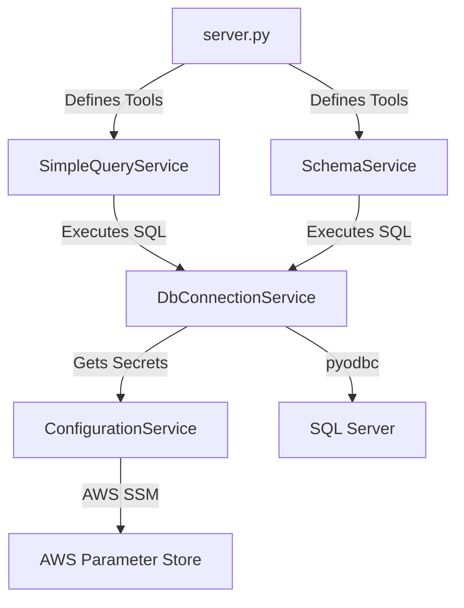

# Mastering MCP & Python: A Practical Guide with `mcp-sql-server`

Welcome! This tutorial uses the `mcp-sql-server` project to teach you the Model Context Protocol (MCP) and the Python concepts used to build it.

## Part 1: What is MCP?

**MCP (Model Context Protocol)** is an open standard that enables AI models (like Claude or Gemini) to interact with external data and tools safely.

Think of it like a **USB-C port for AI applications**. Instead of building custom integrations for every service (Google Drive, Slack, SQL Server) for every AI client (Claude Desktop, Cursor, Zed), you build **one MCP Server** that speaks a standard protocol. Any **MCP Client** can then connect to it.

### Core Concepts
1.  **Server**: The application that exposes data (Resources) and capabilities (Tools). *This project is an MCP Server.*
2.  **Client**: The application that consumes the server (e.g., Claude Desktop, an IDE).
3.  **Protocol**: The JSON-RPC based language they speak to each other.
4.  **Tools**: Functions the AI can call (e.g., `get_query`, `get_scheme`).
5.  **Resources**: Data the AI can read (like files or logs). *This project focuses mainly on Tools.*

---

## Part 2: Project Architecture

This project follows a **Layered Architecture**. This is a common pattern in Python to keep code organized and testable.



1.  **Entry Point (`server.py`)**: Handles the MCP protocol and defines the "Tools" the AI sees.
2.  **Service Layer (`services/`)**: Contains the business logic (validating queries, formatting results).
3.  **Data Access Layer (`db_connection_service.py`)**: Handles the raw database connections.
4.  **Configuration (`configuration_service.py`)**: Manages secrets and environment variables.

---

## Part 3: Code Walkthrough & Python Concepts

### 1. The Server Entry Point (`server.py`)

This file uses the `FastMCP` library, which makes building MCP servers in Python extremely easy (similar to FastAPI).

**Key Python Concept: Decorators**
Decorators are the `@something` lines above functions. They "wrap" the function to add extra behavior.

```python
# server.py

# Initialize the MCP Server
mcp = FastMCP("sql-server-mcp")

# @mcp.tool() tells the MCP server: "Expose this function to the AI"
@mcp.tool()
def get_query(query: str, database: Optional[str] = None) -> Dict[str, Any]:
    """
    Execute SELECT queries...
    """
    # ... implementation ...
```

*   **`FastMCP("name")`**: Creates the server instance.
*   **`@mcp.tool()`**: Automatically generates the tool definition (JSON schema) based on the function signature and docstring.
*   **Docstrings**: The triple-quoted string `"""..."""` is CRITICAL. The AI reads this to understand *how* and *when* to use the tool.

### 2. The Business Logic (`services/simple_query_service.py`)

This service ensures the AI doesn't do anything dangerous (like `DROP TABLE`).

**Key Python Concept: Type Hinting**
Python is dynamically typed, but Type Hints help developers (and tools like `FastMCP`) understand what data to expect.

```python
# services/simple_query_service.py

from typing import Dict, Any, Optional

# "-> Dict[str, Any]" means this function returns a dictionary 
# where keys are strings and values can be anything.
def execute_query(self, query: str, ...) -> Dict[str, Any]:
    # ...
```

**Key Python Concept: Regular Expressions (`re`)**
Used here to validate that the query is a `SELECT` statement and doesn't contain dangerous keywords.

```python
self._SELECT_PATTERN = re.compile(r'^\s*SELECT\b', re.IGNORECASE | re.MULTILINE)
```

### 3. Database Connection (`services/db_connection_service.py`)

This service manages the connection to SQL Server using `pyodbc`.

**Key Python Concept: Context Managers (`with`)**
Context managers ensure resources (like file handles or database connections) are properly closed, even if an error occurs.

```python
# services/db_connection_service.py

# contextlib.closing ensures connection.close() is called at the end of the block
with contextlib.closing(pyodbc.connect(connection_string)) as connection:
    with contextlib.closing(connection.cursor()) as cursor:
        cursor.execute(query)
        return cursor.fetchall()
```

Without `with`, if `cursor.execute(query)` failed, the connection might stay open, leading to memory leaks.

### 4. Configuration (`services/configuration_service.py`)

This service fetches database credentials from AWS Systems Manager (SSM) Parameter Store.

**Key Python Concept: Exception Handling (`try...except`)**
Robust code anticipates failures.

```python
# services/configuration_service.py

try:
    response = self.ssm_client.get_parameter(...)
    self.ssm_json = json.loads(response['Parameter']['Value'])
except ClientError as e:
    # Catch specific AWS errors
    raise ValueError(f"Failed to retrieve SSM parameter: {str(e)}")
```

---

## Part 4: How to Start Your Own MCP Project

1.  **Plan your Tools**: What capabilities do you want to give the AI? (e.g., "Search Jira", "Query Database", "Read Logs").
2.  **Choose a Library**: `mcp` (official SDK) or `fastmcp` (higher-level, easier).
3.  **Define the Interface**: Write Python functions with clear types and docstrings.
4.  **Implement Logic**: Write the code to actually perform the task.
5.  **Connect**: Use an MCP Client (like Claude Desktop) to run your server and test it.

## Summary

You've learned:
*   **MCP** connects AI to the world via a standard protocol.
*   **FastMCP** uses Python **Decorators** and **Type Hints** to auto-generate tool definitions.
*   **Layered Architecture** keeps your code clean and maintainable.
*   **Context Managers** (`with`) are essential for resource management (DB connections).

Now you are ready to build your own MCP server!
